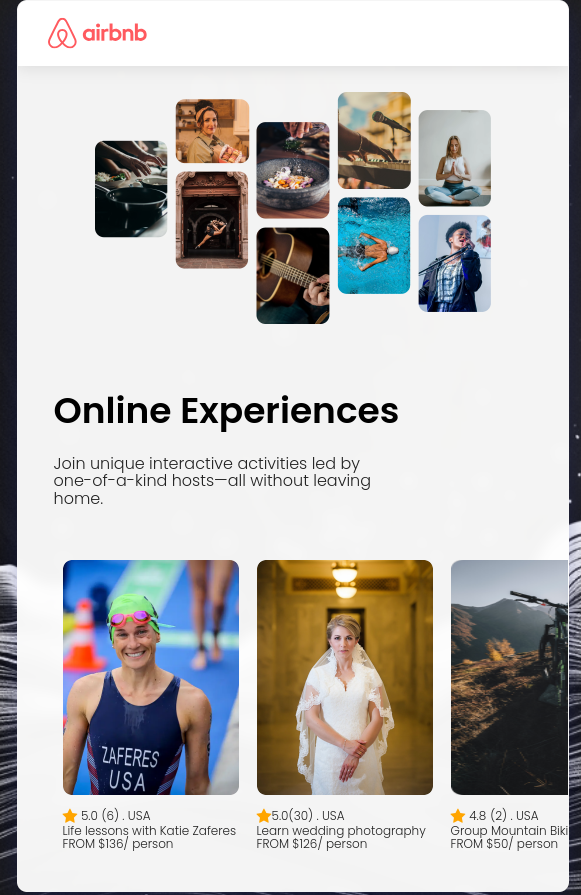

# This is first project from Bob Ziroll React couse on Scrimba 
### [Scrimba Course](https://scrimba.com/learn/learnreact)

### [Figma design link](https://www.figma.com/file/XzM5RS26Mp3DH0qfgIITRl/Airbnb-Experiences-(Copy)?type=design&node-id=0%3A1&mode=design&t=ElJjvoHCWrROtTPP-1)

## In this project we imported some out-links for some awesome details :
### 1- Poppins font from google font
 
    <link rel="preconnect" href="https://fonts.googleapis.com">
    <link rel="preconnect" href="https://fonts.gstatic.com" crossorigin>
    <link href="https://fonts.googleapis.com/css2?family=Poppins:ital,wght@0,100;0,200;0,300;0,400;0,500;0,600;0,700;0,800;0,900;1,100;1,200;1,300;1,400;1,500;1,600;1,700;1,800;1,900&display=swap" rel="stylesheet">
### 2- Font Awesome for display the golden star    
    <link rel="stylesheet" href="https://cdnjs.cloudflare.com/ajax/libs/font-awesome/4.7.0/css/font-awesome.min.css">

## The core project design

## My result after adding glassmorphism effect in background

